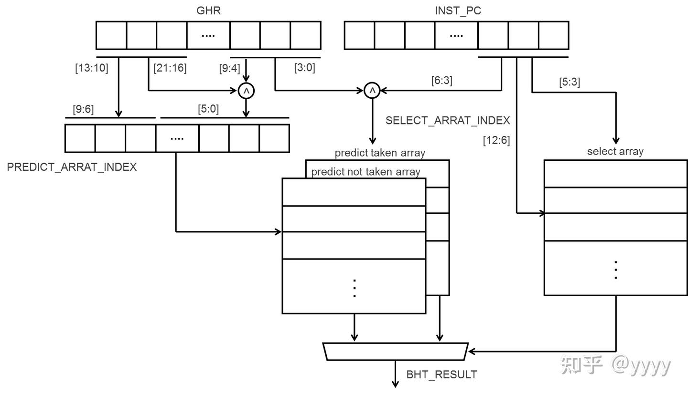

# ct_ifu_bht

## 1. Ports

## 2. Structure



其中：

- predict_array: 物理上1024x64的Memory，逻辑上被分为predict_taken_array和predict_not_taken_array两部分。
  - predict_taken_array: 逻辑上1024x32，存储预测为taken的分支的历史信息。包含1024*16个2bit预测器
  - predict_not_taken_array: 逻辑上1024x32，存储预测为not taken的分支的历史信息。包含1024x16个2bit预测器
- select_array: 物理上128x16的Memory。包含128x8个2bit预测器

## 3. Global History Register (GHR)

bht中存在3个GHR值，分别是：

- VGHR
- RTU_GHR
- BJU_GHR

其中，VGHR 和 RTU_GHR 是在bht中维护的，而BJU_GHR是从bju传递来的信号(iu_ifu_chk_idx)。
BJU_GHR的来源在本节不做详细讲解，本节重点讲解VGHR和RTU_GHR的更新和用途，同时讲解bht对外输出的GHR信号。

### 3.1 VGHR

```verilog
  always @(posedge bht_ghr_updt_clk or negedge cpurst_b)
  begin
    if(!cpurst_b)
      vghr_reg[21:0] <= 22'b0;
    else if(bht_inv_on_reg)
      vghr_reg[21:0] <= 22'b0;
    else if(rtu_ifu_flush && cp0_ifu_bht_en)
      vghr_reg[21:0] <= rtughr_reg[21:0];
    else if(ghr_updt_vld && iu_ifu_bht_check_vld)
      vghr_reg[21:0] <= {bju_ghr[20:0], iu_ifu_bht_condbr_taken};
    else if(ghr_updt_vld && !iu_ifu_bht_check_vld)
      vghr_reg[21:0] <= bju_ghr[21:0];
    else if(vghr_lbuf_updt_vld)
      vghr_reg[21:0] <= {vghr_reg[20:0], lbuf_bht_con_br_taken};
    else if(vghr_ip_updt_vld  && !lbuf_bht_active_state)
      vghr_reg[21:0] <= {vghr_reg[20:0], ipctrl_bht_con_br_taken};
    else
      vghr_reg[21:0] <= vghr_reg[21:0];
  end 
```

| 更新原因 | 更新值 | 备注 |
| :--: | :--: | :--: |
| RTU flush | rtughr_reg[21:0] | 采用rtu的ghr结果恢复VGHR |
| BJU Mispredict 并且是条件分支指令 | {bju_ghr[20:0], iu_ifu_bht_condbr_taken} | 采用bju的ghr结果恢复VGHR，同时更新这条mispredict的指令的预测结果 |
| BJU Mispredict 并且不是条件分支指令 | bju_ghr[21:0] | 采用bju的ghr结果恢复VGHR |
| lbuf激活并且预测条件分支指令 | {vghr_reg[20:0], lbuf_bht_con_br_taken} | 采用lbuf的预测结果 |
| lbuf不激活并且预测条件分支指令 | {vghr_reg[20:0], ipctrl_bht_con_br_taken} | 采用ipctrl的预测结果 |

表中更新情况的优先级从高到低排列。可见，用真实值恢复VGHR的优先级高于用预测值更新VGHR。

### 3.2 RTU_GHR

```verilog
  always @(posedge bht_ghr_updt_clk or negedge cpurst_b)
  begin
    if(!cpurst_b)
      rtughr_reg[21:0] <= 22'b0;
    else if(bht_inv_on_reg)
      rtughr_reg[21:0] <= 22'b0;
    else if(rtughr_updt_vld)
      rtughr_reg[21:0] <= rtughr_pre[21:0];
    else
      rtughr_reg[21:0] <= rtughr_reg[21:0];
  end

  // &CombBeg; @278
  always @( rtu_ifu_retire2_condbr_taken
        or rtu_ifu_retire1_condbr
        or rtu_ifu_retire0_condbr_taken
        or rtughr_reg[21:0]
        or rtu_ifu_retire1_condbr_taken
        or rtu_ifu_retire2_condbr
        or rtu_ifu_retire0_condbr)
  begin
  case({rtu_ifu_retire0_condbr, rtu_ifu_retire1_condbr, rtu_ifu_retire2_condbr})
    3'b000  : rtughr_pre[21:0] =  rtughr_reg[21:0];
    3'b001  : rtughr_pre[21:0] = {rtughr_reg[20:0], rtu_ifu_retire2_condbr_taken};
    3'b010  : rtughr_pre[21:0] = {rtughr_reg[20:0], rtu_ifu_retire1_condbr_taken};
    3'b100  : rtughr_pre[21:0] = {rtughr_reg[20:0], rtu_ifu_retire0_condbr_taken};
    3'b101  : rtughr_pre[21:0] = {rtughr_reg[19:0], rtu_ifu_retire0_condbr_taken, 
                                                    rtu_ifu_retire2_condbr_taken};
    3'b110  : rtughr_pre[21:0] = {rtughr_reg[19:0], rtu_ifu_retire0_condbr_taken, 
                                                    rtu_ifu_retire1_condbr_taken};
    3'b011  : rtughr_pre[21:0] = {rtughr_reg[19:0], rtu_ifu_retire1_condbr_taken, 
                                                    rtu_ifu_retire2_condbr_taken};
    3'b111  : rtughr_pre[21:0] = {rtughr_reg[18:0], rtu_ifu_retire0_condbr_taken, 
                                                    rtu_ifu_retire1_condbr_taken,
                                                    rtu_ifu_retire2_condbr_taken};
    default : rtughr_pre[21:0] =  rtughr_reg[21:0];
  endcase
  // &CombEnd; @295
  end
```

当有指令退休时，根据指令是否为条件分支指令以及是否跳转，更新RTU_GHR。可以看出每个周期最多退休3条指令。

显然，RTU_GHR的值是最真实的，但是旧的；VGHR的值是预测的，但是最新的。因此，在预测分支指令时，使用VGHR的值进行预测。

### 3.3 对外输出的GHR信号

## 4. Array update

## 5. Sel Array Read

## 6. Pred Array Read
