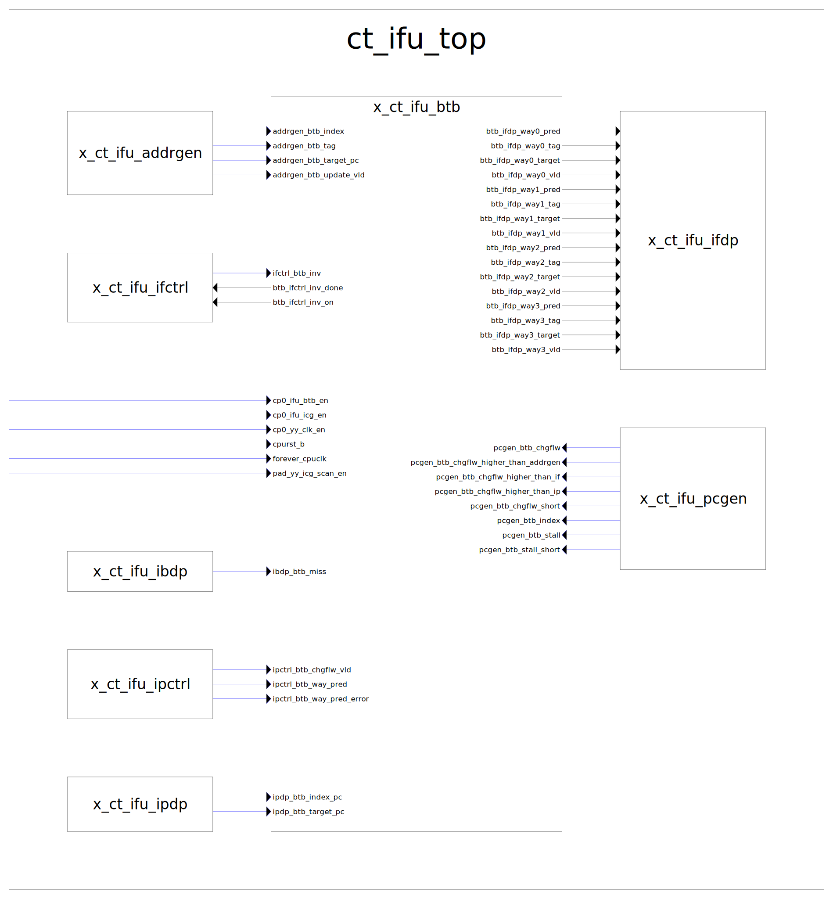

# ct_ifu_btb

## 1. 模块接口



|对接模块|接口功能|
|-|-|
|x_ct_ifu_addrgen | addrgen输入正确的跳转信息，用于更新btb |
|x_ct_ifu_ifctrl  | ifctrl无效btb，获取btb的状态（无效ing、无效完成） |
|ct_ifu_top       | 时钟、复位、使能、dft |
|x_ct_ifu_ibdp    | 通知btb miss |
|x_ct_ifu_ipctrl  | 通知btb cache 路预测错误 |
|x_ct_ifu_ipdp    | 通知btb cache 路预测错误更新结果 |
|x_ct_ifu_ifdp    | 将查询出的4路tag、data输出 |
|x_ct_ifu_pcgen   | 控制 btb change flow |

### 1.2. x_ct_ifu_btb_ifdp

## 2. 模块解析

### 2.1. btb_data_array / btb_tag_array


<center>btb_data_array 和 btb_tag_array 功能框图</center>


<center>btb_data_array entry结构</center>


<center>btb_tag_array entry结构</center>

### 2.2. 功能框图

#### btb pc预测 miss 或 mispredict 处理


|时刻(周期)|描述|
|-|-|
| 0 | 若miss，id级miss信号有效，将refillBuf的valid置0 |
| 1 | addrgen的update信号有效，将refillBuf的valid置0，并且记录target_pc、tag、index |
| 2 | 打拍等待ip级的路预测信息 |
| 3 | ip级路预测信息有效，记录way。addrgen的update vld已经打了两拍，此时将refillBuf的valid置1 |
| 4 | refillBuf写入data_array、tag_array<br>重填way选择：根据vpc[2:1]选择被替换way |

==**重点**：addrgen的update信息比ip级的路预测信息早两拍，因此要等两拍==

#### btb way预测 miss 或 mispredict 处理


|时刻(周期)|描述|
|-|-|
| 0 | IP阶段判定路预测错误，拉高ipctrl_btb_chgflw_vld，并且提供ipdp_btb_*传递PC值。PC值记录倒record寄存器中 |
| 1 | 正确的路预测信息ipctrl_btb_way_pred到达，同时拉高ipctrl_btb_way_pred_error。<br>refillBuf更新：valid写1，record寄存器写入tag、index、target_pc，ipctrl_btb_way_pred写入refillBuf的way |
| 2 | refillBuf写入data_array、tag_array<br>重填way选择：根据vpc[2:1]选择被替换way |

==**重点**：路预测错误发现的下一拍才能拿到正确的路预测信息，因此要等一拍==

#### btb 预测信息输出

##### 设计逻辑

|输出信息|描述|
|-|-|
| 正常查array读出 | 大多数情况下直接从array读出预测值输出 |
| 保持旧的输出不变 | 一些特殊情况下，需要使用旧的预测值（见下源码注释）：<br>1. array要更新预测值，此时会写array，对应的读输出是无效的；<br>2. 当ip_way_mispred时，需要保持旧的输出（*原因呢？，TODO*） |
| refillBuf旁路 | refillBuf要更新array时，如果恰好命中refillBuf，可以直接将refillBuf的预测值输出 |

```
源码注释：

//BTB tag array is enable when:
//1.write enable
//  a.BTB is on inv
//  b.BTB updated by refill buffer && cp0_btb_en
//2.read enable
//  a.Change flow except ip_way_pred_reissue && cp0_btb_en
//    note:way_pred_reissue & ibdp_btb_miss
//         need not to read btb again and
//         use this cycle update refill buffer to btb
//  b.Sequence Read && !pc_stall && cp0_btb_en
//INV > Write enable > Read enable

//When ip_way_mispred, cancel the update of btb_tag_dout_reg
//Maintain the Value of btb_tag_dout_reg as the result of 
//Reissue BTB Read
```

##### 内部寄存器更新


|时刻(周期)|描述|
|-|-|
| 0 | pcgen_btb_index作为地址，读data_array、tag_array，同时index写入btb_index_flop |
| 1 | data_array、tag_array读出值，写入btb_data_dout_reg、btb_tag_dout_reg |

==btb_data_dout_reg、btb_tag_dout_reg的作用是记录之前的预测值，因此只有当输出选择array读出的值时才更新==

##### 输出选择

**预测值的来源共有三个：**
1. btb_data_array、btb_tag_array读出的值，它是当前预测值
2. btb_data_dout_reg、btb_tag_dout_reg，它是之前的预测值
3. refillBuf，它是最新的预测值

其中，refillBuf只有一份，btb_data_array btb_data_dout_reg 各有四路。因此refillBuf只与way0的预测值进行仲裁。

**way0输出仲裁：**
1. 如果上一拍对array读有效(btb_rd_flop)，并且ip级没有出现路预测错误(ip_way_mispred)，就选择**array读出的值**
2. 否则，如果dout_reg中的值有效，就选择**dout_reg的值**
3. 否则，如果refillBuf的valid有效并且index与btb_index_flop相同，就选择**refillBuf的预测值**
4. 否则，way0输出无效，way0 miss

**way1~3输出仲裁：**
1. 如果上一拍对array读有效(btb_rd_flop)，并且ip级没有出现路预测错误(ip_way_mispred)，就选择**array读出的值**
2. 否则，如果dout_reg中的值有效，就选择**dout_reg的值**
3. 否则，输出无效，miss

#### btb chgflw by pcgen

#### btb invalid 处理
