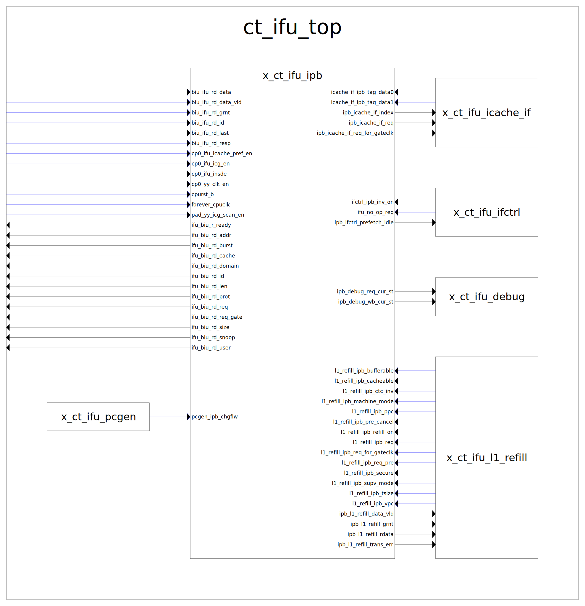

# ct_ifu_ipb

## 1. Port 说明

### 1.1 使能、复位、时钟信号

| **方向** | **位宽** | **信号** | **描述** |
|--|--|--|--|
| input | - | cp0_ifu_icg_en | 时钟门控使能信号 |
| input | - | cp0_yy_clk_en | 全局时钟使能 |
| input | - | cpurst_b | 复位信号,低电平有效 |
| input | - | forever_cpuclk | 永久CPU时钟 |
| input | - | pad_yy_icg_scan_en | 扫描使能信号 |

### 1.2 BIU接口

| **方向** | **位宽** | **信号** | **描述** |
|--|--|--|--|
| input | [127:0] | biu_ifu_rd_data | 读取数据 |
| input | - | biu_ifu_rd_data_vld | 读取数据有效 |
| input | - | biu_ifu_rd_grnt | 读取授权 |
| input | - | biu_ifu_rd_id | 读取ID |
| input | - | biu_ifu_rd_last | 最后一拍数据 |
| input | [1:0] | biu_ifu_rd_resp | 读取响应 |
| output | - | ifu_biu_r_ready | 准备接收数据 |
| output | [39:0] | ifu_biu_rd_addr | 读取地址 |
| output | [1:0] | ifu_biu_rd_burst | 突发传输类型 |
| output | [3:0] | ifu_biu_rd_cache | 缓存属性 |
| output | [1:0] | ifu_biu_rd_domain | 域属性 |
| output | - | ifu_biu_rd_id | 读取ID |
| output | [1:0] | ifu_biu_rd_len | 突发长度 |
| output | [2:0] | ifu_biu_rd_prot | 保护属性 |
| output | - | ifu_biu_rd_req | 读取请求 |
| output | - | ifu_biu_rd_req_gate | 读取请求门控 |
| output | [2:0] | ifu_biu_rd_size | 传输大小 |
| output | [3:0] | ifu_biu_rd_snoop | Snoop属性 |
| output | [1:0] | ifu_biu_rd_user | 用户定义属性 |

### 1.3 ICache接口

| **方向** | **位宽** | **信号** | **描述** |
|--|--|--|--|
| input | [28:0] | icache_if_ipb_tag_data0 | Way0 Tag数据 |
| input | [28:0] | icache_if_ipb_tag_data1 | Way1 Tag数据 |
| output | [33:0] | ipb_icache_if_index | Cache索引 |
| output | - | ipb_icache_if_req | Cache请求 |
| output | - | ipb_icache_if_req_for_gateclk | Cache请求门控 |

### 1.4 L1 Refill接口

| **方向** | **位宽** | **信号** | **描述** |
|--|--|--|--|
| input | - | l1_refill_ipb_bufferable | 可缓冲属性 |
| input | - | l1_refill_ipb_cacheable | 可缓存属性 |
| input | - | l1_refill_ipb_ctc_inv | CTC无效操作 |
| input | - | l1_refill_ipb_machine_mode | 机器模式 |
| input | [39:0] | l1_refill_ipb_ppc | 物理PC |
| input | - | l1_refill_ipb_pre_cancel | 预取取消 |
| input | - | l1_refill_ipb_refill_on | 重填进行中 |
| input | - | l1_refill_ipb_req | 请求信号 |
| input | - | l1_refill_ipb_req_for_gateclk | 请求门控 |
| input | - | l1_refill_ipb_req_pre | 预请求 |
| input | - | l1_refill_ipb_secure | 安全模式 |
| input | - | l1_refill_ipb_supv_mode | 监管者模式 |
| input | - | l1_refill_ipb_tsize | 传输大小 |
| input | [39:0] | l1_refill_ipb_vpc | 虚拟PC |
| output | - | ipb_l1_refill_data_vld | 数据有效 |
| output | - | ipb_l1_refill_grnt | 授权信号 |
| output | [127:0] | ipb_l1_refill_rdata | 读取数据 |
| output | - | ipb_l1_refill_trans_err | 传输错误 |

### 1.5 其他接口

| **方向** | **位宽** | **信号** | **描述** |
|--|--|--|--|
| input | - | cp0_ifu_icache_pref_en | ICache预取使能 |
| input | - | cp0_ifu_insde | 指令侧使能 |
| input | - | ifctrl_ipb_inv_on | 无效操作进行中 |
| input | - | ifu_no_op_req | 无操作请求 |
| input | - | pcgen_ipb_chgflw | PC改变流 |
| output | [3:0] | ipb_debug_req_cur_st | 请求状态机调试 |
| output | [2:0] | ipb_debug_wb_cur_st | 写回状态机调试 |
| output | - | ipb_ifctrl_prefetch_idle | 预取空闲 |

## 2. 状态机描述

### 2.1 预取请求状态机

#### 2.1.1 状态定义

| **状态** | **编码** | **描述** |
|--|--|--|
| IDLE | 4'b0000 | 等待预取启动 |
| CACHE | 4'b0001 | 等待Cache数据 |
| CMP | 4'b0011 | 检查ICache是否已包含预取行 |
| PF_REQ | 4'b0010 | 发送预取请求到BIU |
| PF0 | 4'b0110 | 等待第1拍数据 |
| PF1 | 4'b0111 | 等待第2拍数据 |
| PF2 | 4'b0101 | 等待第3拍数据 |
| PF3 | 4'b0100 | 等待第4拍数据 |
| INV | 4'b1000 | 无效数据并等待数据结束 |

#### 2.1.2 状态转换条件

| **当前状态** | **下一状态** | **转换条件** | **描述** |
|--|--|--|--|
| IDLE | CACHE | pref_launch_start | 预取启动 |
| CACHE | CMP | - | 等待一个周期 |
| CMP | IDLE | ipb_hit | Cache命中 |
| ^ | PF_REQ | !ipb_hit | Cache未命中 |
| PF_REQ | PF0 | biu_pref_grnt | BIU授权 |
| ^ | IDLE | l1_refill_ipb_req && !ref_hit_pref | 重填请求且非预取命中 |
| PF0 | INV | biu_pref_trans_err | 传输错误 |
| ^ | PF1 | biu_pref_data_vld | 数据有效 |
| PF1 | INV | biu_pref_trans_err | 传输错误 |
| ^ | PF2 | biu_pref_data_vld | 数据有效 |
| PF2 | INV | biu_pref_trans_err | 传输错误 |
| ^ | PF3 | biu_pref_data_vld | 数据有效 |
| PF3 | IDLE | biu_pref_data_vld | 数据有效 |
| ^ | IDLE | biu_pref_trans_err | 传输错误 |
| INV | IDLE | biu_pref_last | 最后一拍数据 |

### 2.2 预取写回状态机

#### 2.2.1 状态定义

| **状态** | **编码** | **描述** |
|--|--|--|
| PF_IDLE | 3'b000 | 空闲状态 |
| PF_VLD | 3'b001 | 数据有效 |
| PF_GRNT | 3'b011 | 授权状态 |
| PF_WB0 | 3'b110 | 写回第1拍 |
| PF_WB1 | 3'b111 | 写回第2拍 |
| PF_WB2 | 3'b101 | 写回第3拍 |
| PF_WB3 | 3'b100 | 写回第4拍 |

### 2.3 关键控制信号

1. `pref_launch_vld`
   - 生成条件:
     - BIU授权(biu_ref_grnt)
     - 预取空闲(pref_idle)
     - 可缓存且Cache使能(l1_refill_ipb_tsize)
     - 预取使能(cp0_ifu_icache_pref_en)
     - 无Cache无效操作(!icache_inv_for_pref)
     - 重填特殊条件(ref_for_pref_on)
     - 地址在4K边界内(ref_addr_within_4k)
   - 功能: 触发预取启动

2. `ipb_hit`
   - 生成条件: ipb_way0_hit || ipb_way1_hit
   - 功能: 指示预取地址在Cache中命中

3. `pref_idle`
   - 生成条件: (req_cur_st == IDLE) && (wb_cur_st == PF_IDLE)
   - 功能: 指示预取状态机空闲

4. `icache_inv_for_pref`
   - 生成条件: ifctrl_ipb_inv_on || icache_inv_record
   - 功能: 指示Cache无效操作进行中