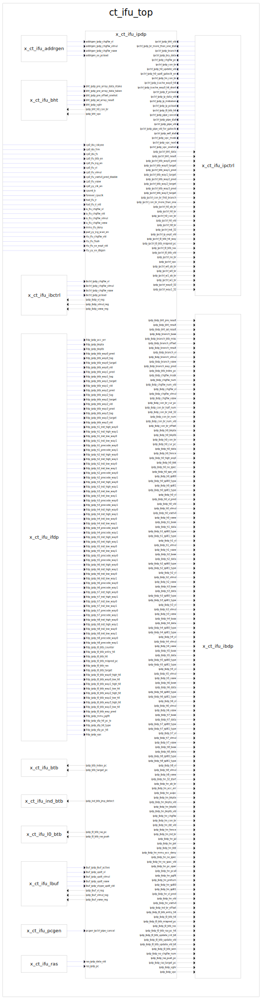

# ct_ifu_ipdp

## 1. 模块接口

|对接模块|接口功能|
|-|-|
|xxx | xxxx |

## 2. 模块解析

### 2.1. btb数据输入和输出

1. 4路预测值，4MUX1，同时判断是否miss
2. 反馈输出给btb：ipdp_btb_target_pc
3. miss和way_pred打一拍输出到ibdp
4. 4路target、way_pred传递给ipctrl
5. ipctrl计算出分支目标：ipctrl_ipdp_chgflw_pc，将它打一拍输出到ibdp

### 2.2. xxxx