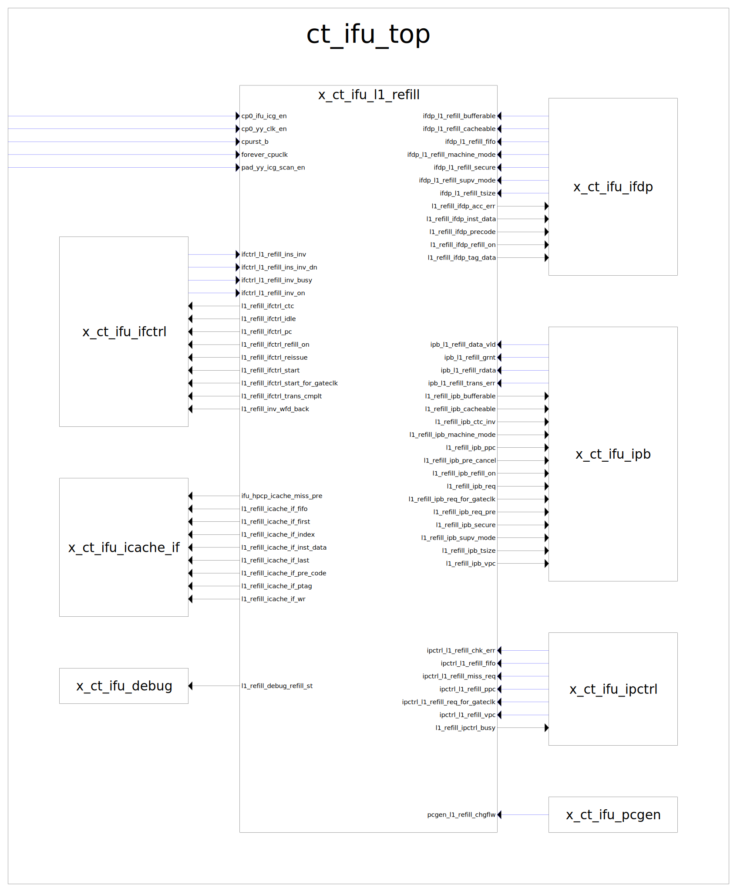
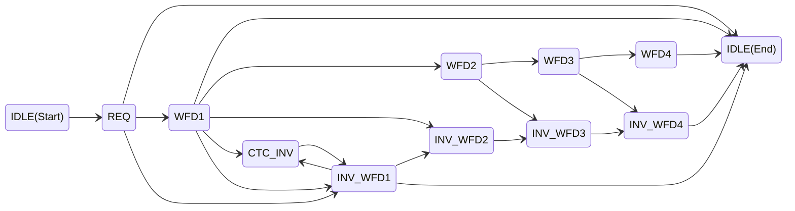

# CT-IFU-L1-Refill

## 1. Port 说明

### 1.1 使能、复位、时钟信号

| **方向** | **位宽** | **信号**           | **描述**            |
| -------- | -------- | ------------------ | ------------------- |
| input    | -        | cp0_ifu_icg_en     | 时钟门控使能信号    |
| input    | -        | cp0_yy_clk_en      | 全局时钟使能        |
| input    | -        | cpurst_b           | 复位信号,低电平有效 |
| input    | -        | forever_cpuclk     | 永久CPU时钟         |
| input    | -        | pad_yy_icg_scan_en | 扫描使能信号        |

### 1.2 高性能计数器接口

| **方向** | **位宽** | **信号**                 | **描述**                 |
| -------- | -------- | ------------------------ | ------------------------ |
| output   | -        | ifu_hpcp_icache_miss_pre | ICache缺失性能计数预指示 |

### 1.3 ifctrl控制接口

| **方向** | **位宽** | **信号**                           | **描述**           |
| -------- | -------- | ---------------------------------- | ------------------ |
| input    | -        | ifctrl_l1_refill_ins_inv           | 指令无效信号       |
| input    | -        | ifctrl_l1_refill_ins_inv_dn        | 指令无效完成信号   |
| input    | -        | ifctrl_l1_refill_inv_busy          | 无效操作忙信号     |
| input    | -        | ifctrl_l1_refill_inv_on            | 无效操作进行中     |
| output   | -        | l1_refill_ifctrl_ctc               | CTC控制信号        |
| output   | -        | l1_refill_ifctrl_idle              | 空闲状态指示       |
| output   | [38:0]   | l1_refill_ifctrl_pc                | 当前PC值           |
| output   | -        | l1_refill_ifctrl_refill_on         | 重填操作进行中     |
| output   | -        | l1_refill_ifctrl_reissue           | 重新发射请求       |
| output   | -        | l1_refill_ifctrl_start             | 开始重填           |
| output   | -        | l1_refill_ifctrl_start_for_gateclk | 时钟门控的开始信号 |
| output   | -        | l1_refill_ifctrl_trans_cmplt       | 传输完成指示       |

### 1.4 ifdp数据通路接口

| **方向** | **位宽** | **信号**                    | **描述**       |
| -------- | -------- | --------------------------- | -------------- |
| input    | -        | ifdp_l1_refill_bufferable   | 可缓冲属性     |
| input    | -        | ifdp_l1_refill_cacheable    | 可缓存属性     |
| input    | -        | ifdp_l1_refill_fifo         | FIFO方式访问   |
| input    | -        | ifdp_l1_refill_machine_mode | 机器模式指示   |
| input    | -        | ifdp_l1_refill_secure       | 安全模式指示   |
| input    | -        | ifdp_l1_refill_supv_mode    | 监管者模式指示 |
| input    | -        | ifdp_l1_refill_tsize        | 传输大小指示   |
| output   | -        | l1_refill_ifdp_acc_err      | 访问错误指示   |
| output   | [127:0]  | l1_refill_ifdp_inst_data    | 指令数据       |
| output   | [31:0]   | l1_refill_ifdp_precode      | 预解码信息     |
| output   | -        | l1_refill_ifdp_refill_on    | 重填进行中     |
| output   | [28:0]   | l1_refill_ifdp_tag_data     | Tag数据        |

### 1.5 icache接口

| **方向** | **位宽** | **信号**                      | **描述**                |
| -------- | -------- | ----------------------------- | ----------------------- |
| output   | -        | l1_refill_icache_if_fifo      | 重填way信息             |
| output   | -        | l1_refill_icache_if_first     | 重填需要4拍,第1拍标识   |
| output   | [38:0]   | l1_refill_icache_if_index     | 重填的index             |
| output   | [127:0]  | l1_refill_icache_if_inst_data | 重填data信息            |
| output   | -        | l1_refill_icache_if_last      | 重填需要4拍,最后1拍标识 |
| output   | [31:0]   | l1_refill_icache_if_pre_code  | 重填precode信息         |
| output   | [27:0]   | l1_refill_icache_if_ptag      | 重填tag信息             |
| output   | -        | l1_refill_icache_if_wr        | 重填使能信号            |

### 1.6 ipb接口

| **方向** | **位宽** | **信号**                      | **描述**       |
| -------- | -------- | ----------------------------- | -------------- |
| input    | -        | ipb_l1_refill_data_vld        | 数据有效       |
| input    | -        | ipb_l1_refill_grnt            | 授权信号       |
| input    | [127:0]  | ipb_l1_refill_rdata           | 读取的数据     |
| input    | -        | ipb_l1_refill_trans_err       | 传输错误指示   |
| output   | -        | l1_refill_ipb_bufferable      | 可缓冲属性     |
| output   | -        | l1_refill_ipb_cacheable       | 可缓存属性     |
| output   | -        | l1_refill_ipb_ctc_inv         | CTC无效操作    |
| output   | -        | l1_refill_ipb_machine_mode    | 机器模式指示   |
| output   | [39:0]   | l1_refill_ipb_ppc             | 物理PC         |
| output   | -        | l1_refill_ipb_pre_cancel      | 预取取消       |
| output   | -        | l1_refill_ipb_refill_on       | 重填进行中     |
| output   | -        | l1_refill_ipb_req             | 请求信号       |
| output   | -        | l1_refill_ipb_req_for_gateclk | 时钟门控请求   |
| output   | -        | l1_refill_ipb_req_pre         | 预请求信号     |
| output   | -        | l1_refill_ipb_secure          | 安全模式指示   |
| output   | -        | l1_refill_ipb_supv_mode       | 监管者模式指示 |
| output   | -        | l1_refill_ipb_tsize           | 传输大小指示   |
| output   | [39:0]   | l1_refill_ipb_vpc             | 虚拟PC         |

### 1.7 ipctrl接口

| **方向** | **位宽** | **信号**                         | **描述**      |
| -------- | -------- | -------------------------------- | ------------- |
| input    | -        | ipctrl_l1_refill_chk_err         | 检查错误指示  |
| input    | -        | ipctrl_l1_refill_fifo            | FIFO访问方式  |
| input    | -        | ipctrl_l1_refill_miss_req        | Cache缺失请求 |
| input    | [38:0]   | ipctrl_l1_refill_ppc             | 物理PC        |
| input    | -        | ipctrl_l1_refill_req_for_gateclk | 时钟门控请求  |
| input    | [38:0]   | ipctrl_l1_refill_vpc             | 虚拟PC        |
| output   | -        | l1_refill_ipctrl_busy            | 忙状态指示    |

### 1.8 pcgen接口

| **方向** | **位宽** | **信号**               | **描述**         |
| -------- | -------- | ---------------------- | ---------------- |
| input    | -        | pcgen_l1_refill_chgflw | PC改变的重新取指 |

### 1.9 调试接口

| **方向** | **位宽** | **信号**                  | **描述**         |
| -------- | -------- | ------------------------- | ---------------- |
| output   | [3:0]    | l1_refill_debug_refill_st | 重填状态调试信息 |
| output   | -        | l1_refill_inv_wfd_back    | 无效等待回写指示 |

## 2. 状态机描述

### 2.1 状态定义

| **状态** | **编码** | **描述**              |
| -------- | -------- | --------------------- |
| IDLE     | 4'b0000  | 等待 ICache 重填请求  |
| REQ      | 4'b0001  | 等待 BIU 授权或流改变 |
| WFD1     | 4'b0100  | 等待第1拍有效重填数据 |
| WFD2     | 4'b0101  | 等待第2拍有效重填数据 |
| WFD3     | 4'b0110  | 等待第3拍有效重填数据 |
| WFD4     | 4'b0111  | 等待第4拍有效重填数据 |
| INV_WFD1 | 4'b1000  | 等待第1拍无效重填数据 |
| INV_WFD2 | 4'b1001  | 等待第2拍无效重填数据 |
| INV_WFD3 | 4'b1010  | 等待第3拍无效重填数据 |
| INV_WFD4 | 4'b1011  | 等待第4拍无效重填数据 |
| CTC_INV  | 4'b0011  | 优先执行 CTC 无效操作 |

### 2.2. 状态转换图

### 2.3 状态转换条件

| **当前状态** | **下一状态** | **转换条件** | **描述** |
|-------------|--------------|--------------|----------|
| IDLE | REQ | `refill_start` | 收到重填请求且无无效操作 |
| REQ | IDLE | `change_flow && !refill_grnt` | PC无效，总线未授权 |
| ^ | ^ | `ifctrl_l1_refill_ins_inv` | 收到指令无效信号 |
| ^ | WFD1 | `!change_flow && refill_grnt` | PC有效，总线授权 |
| ^ | INV_WFD1 | `change_flow && refill_grnt` | PC无效，总线授权 |
| WFD1 | WFD2 | `ipb_refill_data_vld && tsize` | 收到有效数据，需要写入cache |
| ^ | INV_WFD2 | `ipb_refill_trans_err && tsize` | 收到无效数据，需要写入cache |
| ^ | IDLE | `ipb_refill_data_vld && !tsize` | 收到有效数据，不需要写入cache |
| ^ | ^ | `ipb_refill_trans_err && !tsize` | 收到无效数据，不需要写入cache |
| ^ | INV_WFD1 | `change_flow` | PC无效 |
| ^ | CTC_INV | `ifctrl_l1_refill_ins_inv` | 收到指令无效 |
| WFD2 | WFD3 | `ipb_refill_data_vld` | 收到有效数据 |
| ^ | INV_WFD3 | `ipb_refill_trans_err` | 发生传输错误 |
| WFD3 | WFD4 | `ipb_refill_data_vld` | 收到有效数据 |
| ^ | INV_WFD4 | `ipb_refill_trans_err` | 发生传输错误 |
| WFD4 | IDLE | `ipb_refill_data_vld \|\| ipb_refill_trans_err` | 数据或错误完成 |
| INV_WFD1 | INV_WFD2 | `ipb_refill_data_vld \|\| ipb_refill_trans_err` | 有效数据或传输错误 |
| ^ | CTC_INV | `ifctrl_l1_refill_ins_inv` | 收到指令无效 |
| ^ | IDLE | `ipb_refill_data_vld && !tsize` | 收到有效数据，不需要写入cache |
| INV_WFD2 | INV_WFD3 | `ipb_refill_data_vld \|\| ipb_refill_trans_err` | 有效数据或传输错误 |
| INV_WFD3 | INV_WFD4 | `ipb_refill_data_vld \|\| ipb_refill_trans_err` | 有效数据或传输错误 |
| INV_WFD4 | IDLE | `ipb_refill_data_vld \|\| ipb_refill_trans_err` | 有效数据或传输错误 |
| CTC_INV | INV_WFD1 | `ifctrl_l1_refill_ins_inv_dn && inv_wfd_back` | cache无效完成，去写回 |

### 2.3 关键控制信号

1. `refill_start`
   - 生成条件: `ipctrl_l1_refill_miss_req && !ifctrl_l1_refill_inv_on`
   - 功能: 触发重填状态机启动

2. `change_flow`
   - 来源: `pcgen_l1_refill_chgflw`
   - 功能: 指示PC发生改变

3. `refill_grnt`
   - 来源: `ipb_l1_refill_grnt`
   - 功能: BIU授权信号

4. `inv_wfd_back`
   - 置位条件: `ifctrl_l1_refill_ins_inv && (state == INV_WFD1 || state == WFD1)`
   - 清零条件: `refill_start && (state == IDLE)`
   - 功能: 记录是否需要等待回写

5. `tsize`
   - 来源: `ipb_l1_refill_tsize`
   - 功能: 指示refill的数据是否要写入cache
   - 逻辑: icache enable 并且 PC地址是cacheable的

## 3. 代码实现

1. L1 Refill to icache if
   1. ipb_l1_refill_rdata[127:0] -> byte重排 -> ipb_l1_refill_data_aft_v2trans[127:0]，为什么要重排？
   2. index_inc_vld时，physical_pc、virtual_pc加8的原因：pc使用的是地址的[32:1]，加8实际上是地址加16
2. The Precode Information
   1. 预编码为纯组合逻辑
3. Refill State Machine on/busy Signal
   1. refill_sm_on信号的作用存疑
